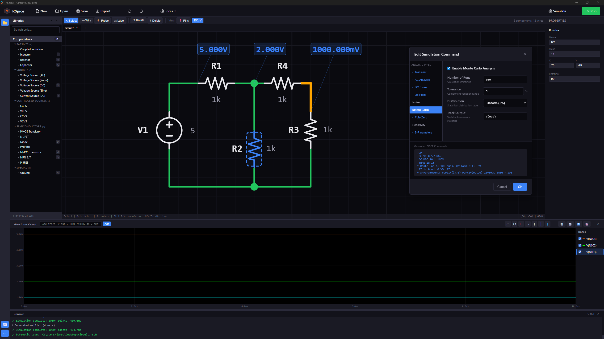
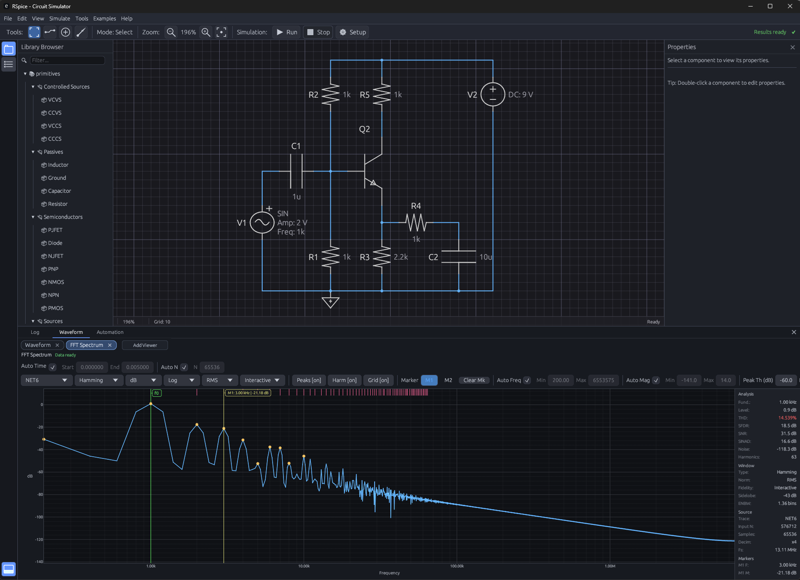

<div align="center">


# RSpice

**A SPICE circuit simulator written in Rust, with a desktop UI, CLI, Python bindings, and a Verilog-A compiler.**

[](LICENSE)
[](rust-toolchain.toml)
[](https://github.com/JaimeHW/rspice)




</div>

## Overview

RSpice is a circuit simulator for analog and mixed-signal design. The simulation engine, netlist parsers, device models, and analyses are implemented in Rust on top of sparse matrix solvers, with adaptive timestep control and configurable convergence aids for difficult circuits.

Around the engine, the repository provides several front ends: a desktop application for schematic capture and waveform inspection, a CLI for scripted and batch workflows, Python bindings for automation, WebAssembly bindings, and a Verilog-A toolchain for compiling behavioral models.

## Status

RSpice is in active development. The implemented surface is broad — the analyses and device models listed below exist and are exercised by tests — but polish and coverage vary by area, and results are continuously validated against ngspice rather than assumed correct. It is not yet a substitute for mature EDA tooling.

## Features

### Analyses

- **Core:** DC operating point, DC sweep, transient, AC small-signal, temperature sweep
- **Frequency-domain:** noise, distortion, pole-zero, transfer function, stability, S-parameter
- **Statistical and parametric:** Monte Carlo, process corners, `.STEP` parametric sweeps, sensitivity
- **RF and periodic:** periodic steady-state (PSS) with shooting method, harmonic balance, PAC, PNoise, PXF, PSTB, envelope and multi-rate methods
- **Post-processing:** `.MEAS` measurements, Fourier / `.FOUR`, eye-diagram and signal-integrity utilities

### Device Models

- **MOSFET:** BSIM4, BSIM3, B3SOI (DD/FD/PD), EKV, VDMOS, classic level models
- **Bipolar:** Gummel-Poon BJT with a VBIC charge-model option
- **Other semiconductors:** diode, JFET, GaN HEMT
- **Passives:** resistor, capacitor, inductor, coupled inductors, saturable inductor with Jiles-Atherton hysteresis
- **Interconnect:** ideal, lossy, coupled, and distributed transmission lines
- **Behavioral:** controlled sources, behavioral sources, op-amp macromodel, PWL file sources, switches
- **Mixed-signal:** XSPICE-style elements, tri-state drivers, and digital bridges
- **Verilog-A:** compiled behavioral modules

### Verilog-A

`rspice-veriloga` provides a parser, semantic analysis pipeline, and VM-based runtime for Verilog-A modules, with optional native code generation through a Cranelift JIT (the `native` feature).

### Output Formats

Results can be written as SPICE raw (binary or ASCII), CSV, TSV, JSON, or HDF5. The HDF5 writer is self-contained — no native HDF5 library is required.

## Workspace

| Crate | Purpose |
| :--- | :--- |
| `rspice-core` | Simulation engine, device models, analyses, parsers, and regression harnesses |
| `rspice-cli` | Command-line interface for simulation, validation, conversion, and reporting |
| `rspice-ui` | Desktop application for schematic editing and waveform inspection |
| `rspice-veriloga` | Verilog-A parser, semantic pipeline, runtime, and optional native codegen |
| `rspice-python` | Python bindings built with PyO3 |
| `rspice-wasm` | WebAssembly bindings for the simulation engine |

Crate-specific documentation:
- [CLI README](crates/rspice-cli/README.md)
- [Python README](crates/rspice-python/README.md)

## Building

The toolchain is pinned to Rust 1.94 via [rust-toolchain.toml](rust-toolchain.toml); rustup will pick it up automatically.

```bash
git clone https://github.com/JaimeHW/RSpice.git
cd RSpice
cargo build --release --workspace
```

Optional host-tuned build:

```bash
RUSTFLAGS="-C target-cpu=native" cargo build --release --workspace
```

## Quick Start

Create a netlist, `rc_circuit.sp`:

```spice
* Simple RC Circuit
V1 1 0 PULSE(0 5 0 1n 1n 1u 2u)
R1 1 2 1k
C1 2 0 1n

.TRAN 10n 5u
.MEAS TRAN risetime TRIG V(2) VAL=0.5 RISE=1 TARG V(2) VAL=4.5 RISE=1
.END
```

Run it with the CLI:

```bash
cargo run -p rspice-cli --release -- run rc_circuit.sp
```

Write the results to HDF5 instead:

```bash
cargo run -p rspice-cli --release -- run rc_circuit.sp -o rc_circuit.h5 --format hdf5
```

### Desktop UI

```bash
cargo run -p rspice-ui --release
```

### Python

```bash
cd crates/rspice-python
pip install maturin
maturin develop --release
```

```python
import rspice

netlist = rspice.Netlist.parse("V1 1 0 10\nR1 1 0 1k\n.end")
engine = rspice.Engine()
result = engine.run_dc_op(netlist)
print(result.voltage(1))
```

## CLI

The CLI is built for scripted runs and CI: it executes the analyses requested by a netlist, validates and inspects netlists, converts between output formats, and compares results against golden references with JUnit/TAP reporting.

| Command | Description |
| :--- | :--- |
| `rspice run` | Execute simulations |
| `rspice info` | Print parsed netlist information |
| `rspice check` | Validate syntax and connectivity |
| `rspice compare` | Compare output against a golden result |
| `rspice convert` | Convert between RAW, ASCII RAW, CSV, JSON, TSV, and HDF5 |
| `rspice compile-va` | Compile Verilog-A models |

```bash
# Quiet batch run with a JUnit report
rspice run circuit.sp -q --report-format junit --report-file results.xml

# Compare results to a golden file
rspice compare results.csv golden.csv --abstol 1e-9 --reltol 1e-6
```

Full command and option reference: [crates/rspice-cli/README.md](crates/rspice-cli/README.md).

## Testing

RSpice is validated at four levels: unit tests inside each crate, oracle-replay fixture tests for history-coupled device runtimes, integration tests under `crates/rspice-core/tests/`, and an ngspice regression harness that runs the official ngspice test suite (vendored under `tests/`, including the checked-in reference `.out` oracles) against the RSpice engine.

```bash
# Unit and integration tests for the core engine
cargo test --release -p rspice-core

# The ngspice regression suite only
cargo test --release -p rspice-core --test ngspice_regression

# One suite (e.g. transient decks), with per-deck pass/fail and mismatch detail
cargo test --release -p rspice-core --test ngspice_regression -- test_ngspice_transient_suite
```

### Oracle-Replay Fixture Tests

Convolution-based transmission-line runtimes integrate their own discrete solution history, so an end-to-end waveform comparison cannot separate device-model fidelity from solver-timestep differences. Replay fixtures close that gap: ngspice's committed history samples and per-iteration branch right-hand sides are extracted from an instrumented oracle run (gdb on the vendored ngspice source) and checked into the repo (for example `device/transmission_line/testdata/`), and the test drives the RSpice runtime with the oracle's own inputs, asserting the produced stamps match the oracle's point-by-point. This pins the recursion — including ngspice's mixed integer-picosecond/fractional-delta clock — independently of any timestep-control differences.

### ngspice Regression Harness

The harness (`crates/rspice-core/src/testing/ngspice_runner/`) discovers every `.cir` deck under `tests/`, executes the analyses each deck requests (`.op`, `.dc`, `.tran`, `.ac`, `.pz`, `.noise`, `.sens`, `.tf`), and compares results row-by-row against the reference tables with a 2% relative tolerance plus probe-aware absolute floors. Every executed analysis must be backed by a validation oracle — checked-in reference data, `_t`/`_g` gold-node assertions, or an explicit entry in `tests/validation-manifest.tsv` — so no deck can pass silently.

Because reference tables sample each binary's internally chosen timesteps, two narrowly gated fallbacks keep the comparison measuring accuracy rather than step-sequence reproduction: steep transient rows allow a slope-gated time-jitter window of one local reference timestep (ngspice itself reproduces its own tables only to within a step at fast edges), and rows where the reference oscillates at sample scale are compared against the local reference envelope. Operating points, smooth regions, and settled levels always keep the strict pointwise tolerances.

Each deck runs in an isolated watchdog-supervised process (`rspice-ngspice-case-runner`), so a hung simulation cannot stall the suite. Useful environment variables:

| Variable | Effect |
| :--- | :--- |
| `RSPICE_NGSPICE_HARD_CASE_TIMEOUT_MS` | Raise the per-deck hard watchdog (default 30000) for long ring-oscillator decks |
| `RSPICE_NGSPICE_LIVE_REFERENCES=1` | Compare against a live local ngspice instead of checked-in oracles (requires `NGSPICE_SOURCE_ROOT` and `NGSPICE_EXE`) |
| `RSPICE_LTE_DEBUG=1` / `RSPICE_GRID_DEBUG=1` | Log binding LTE charge branches and accepted-step decisions for timestep-parity debugging |

## License

RSpice is source-available software licensed under the [RSpice Personal Use License](LICENSE). Personal, educational, and open academic use are permitted; commercial use requires a separate license — see the license text for details.
