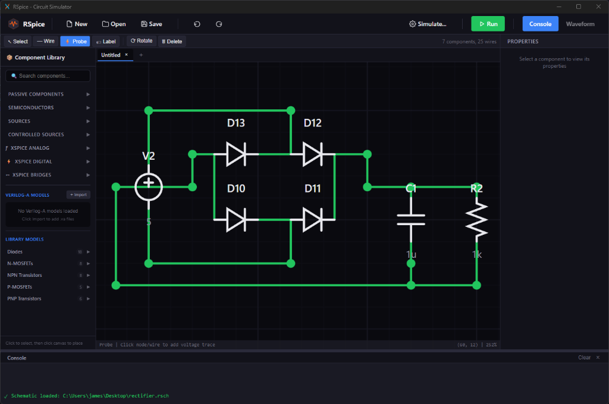

<div align="center">

# 

**The Circuit Simulator, Reimagined.**

[](LICENSE)
[](https://www.rust-lang.org)
[](https://github.com/rspice/rspice/actions)

<br/>



<br/>

*Next-generation analog verification for the modern era.*

</div>

---

## Why RSpice?

Legacy circuit simulators are stuck in the past—burdened by decades of technical debt, clunky interfaces, and inefficient solvers.

**RSpice** is built for **now**. Engineered from the ground up in Rust, it merges the accuracy of commercial SPICE tools with the performance of modern parallel computing and the usability of next-gen design tools.

It isn't just a simulator; it's a complete verification platform designed for speed, scale, and the cloud-native future.

## Engineered for Performance

### ⚡ Uncompromising Speed
Powered by **`faer`** and **`rayon`**, the core engine leverages state-of-the-art sparse linear algebra and multi-threaded execution. Experience transient analysis and parametric sweeps that fully utilize your hardware limits.

### 🔌 Native Verilog-A
Forget external C compilers. RSpice features a **JIT-compiled Verilog-A engine** (via Cranelift). It compiles industry-standard compact models directly to native machine code in milliseconds, offering commercial-grade model support without the toolchain headaches.

### 🎨 GPU-Accelerated Studio
The RSpice Studio interfaces (Web & Desktop) are rendered entirely on the GPU. With **`wgpu`** and **`dioxus`**, you get fluid 60FPS schematic capture, real-time waveform navigation, and a responsive experience that feels alive.

## Getting Started

### Prerequisites
*   **Rust 1.85+** (The bleeding edge of performance requires the latest tools).

### Installation

```bash
git clone https://github.com/rspice/rspice.git
cd rspice

# Build with native optimizations for maximum throughput
RUSTFLAGS="-C target-cpu=native" cargo build --release
```

## Running RSpice

### 🖥️ The Studio (GUI)
Launch the integrated design environment:
```bash
cargo run -p rspice-ui --release
```

### ⚙️ The Engine (CLI)
Execute headless simulations for batch verification:
```bash
cargo run -p rspice-cli --release -- design.cir
```

## Roadmap

We are building the foundation for the next decade of EDA.

*   [ ] **Advanced RF**: Harmonic Balance & Shooting Newton.
*   [ ] **Cloud Native**: Distributed simulation dispatch.
*   [ ] **Model Import**: Direct reading of PSpice/LTspice encrypted libraries.
*   [ ] **Layout**: Integrated PCB & IC layout views.

## License

RSpice is open source, dual-licensed under [MIT](LICENSE-MIT) and [Apache 2.0](LICENSE-APACHE).

---

<div align="center">
  <sub>Built with 🧡 in Rust.</sub>
</div>
