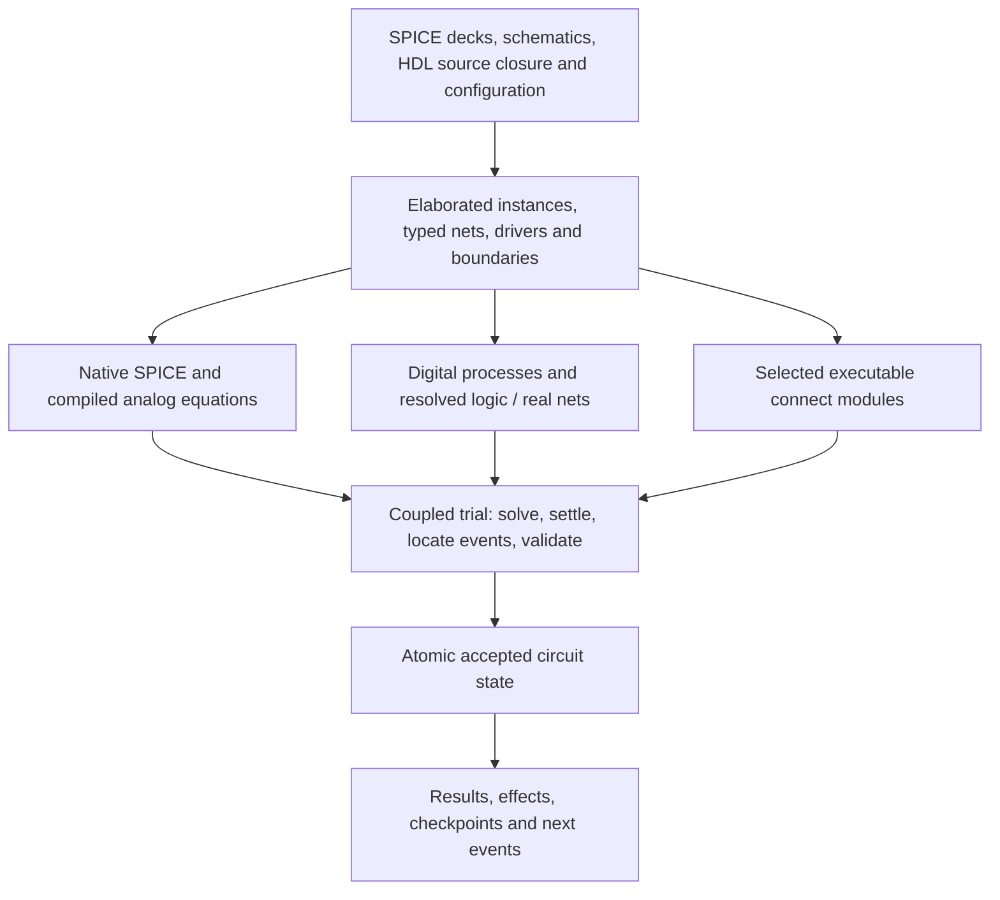

# Mixed SPICE / Verilog-AMS simulation implementation plan

Status: implementation plan; remaining packages are open. Baseline: `e89b1494b88a7cfd56fadaac22e1c0f3b6eb288d`, September 10, 2026.

Current implementation changes, focused verification and remaining limits are recorded in [the execution ledger](execution.md). The baseline descriptions below are historical; a completed increment does not close an entire MS package.

## Objective and relationship to existing work

Complete RSpice's unified mixed-simulation engine so that the supported SPICE and Verilog-AMS design workflows, correctness, analysis coverage, reliability, and measured performance can be qualified against a specified Cadence reference configuration. Retain Rust, EGUI, the shared analog solver, compiler-independent runtime, and desktop/browser/tablet delivery.

This is the mixed-simulation execution companion to `VERILOG_AMS_IMPLEMENTATION_PLAN.md` (the existing local WP roadmap). Its WP packages remain the authority for the underlying language/compiler/backend work. The MS identifiers below retain the earlier audit addendum's identifiers. One implementation and one evidence record should close both the relevant WP and MS requirements. This document supersedes that addendum's stale pre-fix status and first-action sequence.

Cadence's relevant mixed-signal reference is **Spectre AMS Designer**, which combines its analog simulation technology with Xcelium and also advertises RNM and broader digital verification facilities. Select and record the exact installed release, engines, options, and licensed features used for comparison. A product overview is not an executable compatibility specification. [Cadence product description](https://www.cadence.com/en_US/home/tools/custom-ic-analog-rf-design/circuit-simulation/spectre-ams-designer.html).

Reference availability (September 11, 2026): the user confirmed that no licensed reference installation is available yet. Implementation proceeds against the standards and independent circuit expectations; the exact release/configuration comparison remains an open MS00/MS15 qualification dependency.

Use **Accellera VAMS-2023** as the normative Verilog-AMS target, matching the parent roadmap. Maintain separate entries for standard requirements, supported SPICE dialects, and reference-tool extensions. Historical audit references to the 2.4 LRM remain evidence provenance; reconcile clause identifiers before closing requirements. [Accellera language reference](https://www.accellera.org/images/downloads/standards/v-ams/VAMS-LRM-2023.pdf).

The target here includes transistor/behavioral hierarchy, analog/digital feedback, real-number modeling, configurable connections, applicable mixed analyses, restart, debugging, and all three product platforms. Cadence's additional SystemVerilog/UVM, UPF, VHDL/SystemC, verification-coverage, and proprietary integration facilities need their own compatibility rows if advertised. Completing this plan supports a specifically scoped SPICE/Verilog-AMS parity claim; an unrestricted claim about the entire Cadence verification environment additionally requires those rows. Do not substitute a smaller advertised scope to close an unfinished required mixed-simulation feature.

## What is already implemented

Preserve and reuse commit `e89b1494b` and its [fix record](../../audits/unified-engine-2026-09-10/fixes.md). Do not repeat the completed bug-fix pass.

| Completed baseline behavior | Remaining completion work |
|---|---|
| Scheduled and time-zero digital potential reads use the current analog candidate | Generalize the contract to the complete elaborated circuit, variable/flow reads, and event controls |
| An analog crossing no longer drains unrelated future timers | Implement complete time-unit/precision semantics and global event coordination |
| Included/macro-bearing files are examined for connect rules | Unify file, virtual-source, configuration, cache, and executable connect-body handling |
| Built-in D/A `Z` releases its analog node | Complete loading, delays, bidirectional, RNM, and user-authored conversion behavior |
| Scalar numeric overrides specialize both halves, including dependent defaults and packed dimensions | Complete supported parameter types, hierarchy/configuration, update/sweep behavior, and resource/identity integration |
| Scalar/real digital variables supply analog equations with rollback | Complete cross-domain types, arrays, wide values, both directions of access, and event semantics |

The existing focused circuit regressions and host/compiler coverage are reusable evidence. They do not close the remaining packages. Mixed analysis guards, real/bidirectional boundary refusals, per-instance event isolation, fixed 1 ns time units, and the persisted-checkpoint blocker still exist at this baseline.

## Architecture to implement

One elaborated design and one logical scheduling/acceptance authority will own the simulation. Physical event queues may be partitioned later, provided they preserve that authority's ordering and causality.

Implement the following shared contracts before expanding individual features:

1. **Elaborated design:** stable instance/net/driver identities, resolved domains and tolerances, effective parameters, source spans, model/configuration identity, and analysis capabilities.
2. **Time and events:** module time units and precision, global ordering, scheduling region, physical activation time, reporting time, event origin, and cancellation identity. Analog steps remain continuous; they are not forced onto a digital sampling grid.
3. **Cross-domain bindings:** ownership, type/conversion policy, read dependencies, invalidation, event subscriptions, and the analog unknown/state a probe refers to.
4. **Coupled trial:** stage from accepted state, evaluate analog candidates and eligible digital work, settle the coupled boundary, refine event times as required, validate every participant, then commit once. Rejection restores the entire design's accepted state and pending work.
5. **Effects and observations:** source-located errors and task semantics, accepted waveform publication, defined random/noise state, and exactly-once delivery where required. Observation must not mutate simulation state.
6. **Capabilities and identity:** one matrix drives analysis dispatch, backend selection, cache/checkpoint compatibility, public APIs, and user-visible support reporting.

Keep native SPICE, analog-only Verilog-A, and mixed analog equations in the same residual/Jacobian system. Retain physical loads and intentional electrical connections. A genuinely digital subnetwork should use event nets rather than acquiring voltage unknowns and fixed-resistance converters at every module boundary.

## Delivery order and ownership

Roles below identify component responsibility, not new agents. Reconcile ownership with the existing core and Verilog workstreams before overlapping edits. Preserve their current commits and use an isolated checkout/build directory for implementation. This planning change creates no new task and sends no instructions to the running tasks.

| Milestone | Packages | Concrete exit condition |
|---|---|---|
| M0: contracts and reference scope | MS00; interface designs for MS02–MS06 | Finite requirement/capability inventory, reference configuration, interfaces, ownership, and numerical/performance budgets recorded |
| M1: elaborated circuit and exact time | MS01, MS02, MS04 | Hierarchical SPICE/HDL design resolves typed nets, parameters, configurations, and module timing correctly |
| M2: whole-circuit mixed execution | MS05, MS03, MS06 | Multi-instance digital/SPICE/XSPICE feedback settles and commits atomically with correct value/event access |
| M3: complete boundaries | MS07 | RNM, bidirectional/tied ports, authored connect bodies, loading, and timed conversion execute |
| M4: analyses and restart | MS08 and MS10, then MS09 | Applicable mixed equilibrium/small-signal/periodic analyses and persisted continuation execute correctly |
| M5: shipping execution and workflows | MS11–MS13, developed alongside M1–M4 | Actual promised backends and desktop/browser/tablet workflows execute the same supported designs |
| M6: performance and release | MS14, MS15 | Defined correctness, compatibility, capacity, performance, and deployment gates pass on the integrated release candidate |

Critical path: MS00 → MS01/MS02 → MS04 → MS05 → MS03/MS06 → MS07 → MS08/MS10 → MS09 → MS15. Backend and product work follows each stable interface increment; it is not deferred until the end. MS14 records the baseline in M0 and optimizes after the relevant semantics stabilize.

## Work packages

### MS00 — Lock the support contract and acceptance inventory

Owner: integration with core/compiler leads. Parent: WP00, WP16, WP23. Dependencies: none.

- Inventory all advertised language forms, SPICE dialect/model combinations, analyses, boundaries, APIs, execution backends, and deployment targets. Connect each requirement to a standard clause or documented compatibility contract and a representative use case.
- Give every row separate implementation and qualification states: open, implemented, qualified, failed, or unavailable. Record owning package, closing commit, relevant test/workload, target, and limitations. An intentional refusal does not satisfy a required valid case.
- Select the reference Spectre AMS configuration and licensed model/design corpus. Separate standard behavior from vendor extensions and documented defaults; define how ambiguous/racy programs are treated.
- Freeze fixture-specific error budgets and workload-specific performance/resource budgets before comparing results. Include the current successful fixtures instead of rebuilding an equivalent baseline.

Exit: a finite inventory and reference contract can answer exactly what the intended parity claim covers. Missing licensed infrastructure is recorded as a qualification dependency while implementation proceeds.

### MS01 — One source/configuration closure for models and connections

Owner: compiler/source transport with integration. Parent: WP05, WP09, WP17. Dependencies: MS00.

- Make model compilation, connect-rule selection, and hierarchy/configuration selection consume the same active preprocessed source closure. Include file/virtual sources, nested includes, macros, conditional compilation, include search policy, default disciplines, and selected modules/views.
- Discover connect specifications before instance construction. Resolve duplicates and selection consistently; report ambiguity with source locations. Preserve user-authored bodies even when their names match built-ins.
- Carry the closure/configuration identities through compiled artifacts, parameter specialization, memory/disk caches, workers, and public registration APIs. Share parsed/elaborated data where practical so rule discovery does not repeatedly preprocess a large library.
- Correct stale diagnostics that describe working mixed execution as unwired or categorically off-grid.

Exit: direct, included, cached, and virtual forms of the same active design select the same models and connections; an active dependency change invalidates all affected artifacts. Inactive source cannot silently select a different bridge.

### MS02 — Exact module time, event timestamps, and delay semantics

Owner: compiler timing plus core scheduler. Parent: WP06, WP07, WP10. Dependencies: MS00; timing metadata feeds MS04.

- Replace the fixed `TIME_UNIT_EXPONENT = -9` assumption with elaborated time units/precision, correct directive scope, delay expression evaluation, rounding, and checked conversion. Cover fractional delays, time values, hierarchy with different precisions, large ticks, overflow, and zero-delay scheduling.
- Represent physical analog activation separately from rounded digital reporting time. Preserve provenance for scheduled timers, interpolated/root-located analog events, external stimuli, and their causal descendants.
- Keep active/inactive/nonblocking and other supported language regions explicit. Give delayed assignments, transport/inertial behavior where applicable, cancellation, and restart a shared definition.
- Extend the recent early-timer fix into this contract. Do not round analog solver time globally or execute future timers to make domains appear synchronized.

Exit: long-running mixed clocks and off-grid crossings retain correct ordering without cumulative tick drift; immediate crossing consequences occur at their physical boundary while unrelated and delayed work remains scheduled correctly.

### MS04 — Elaborate typed connectivity, parameters, and hierarchy

Owner: compiler elaboration plus core builder. Parent: WP05, WP08, WP09, WP16. Dependencies: MS01, MS02 metadata.

- Build the design graph before solver allocation. Represent electrical/custom conservative nets, four-state event nets, real-valued nets, resolved drivers, vectors/arrays, branches, and hierarchy explicitly.
- Join HDL-to-HDL and HDL-to-XSPICE digital connections directly. Define the deck/project representation for a deliberate event net while preserving existing electrical-node meaning and analog loads.
- Insert conversions only at resolved domain boundaries. Support grounded/tied inputs, nonzero and ascending ranges, port aliases, model/view/configuration selection, generate structures, and parameterized instances.
- Complete effective parameter handling across supported types, aliases, dependent defaults, arrays/structural values, multiplicity, temperature, and simulation configuration. Ensure sweeps/updates rebuild topology or invalidate specialization when required. Preserve `$param_given`, range validation, specialization sharing, and failure atomicity.

Exit: a parameterized hierarchical circuit elaborates once into a consistent mixed graph; a digital chain adds no unnecessary analog unknowns; loaded analog boundaries keep their physical equations. Invalid connections identify the actual instance, port, and source.

### MS05 — Circuit-wide scheduling and atomic acceptance

Owner: core integration, with compiler process-state interfaces. Parent: WP03, WP07, WP10, WP16. Dependencies: MS02, MS04; use the MS00 coupled-trial contract.

- Replace isolated per-instance scheduling authority with a design-level coordinator over digital processes, XSPICE participants, and analog boundary events. Stable global identities and declared ordering govern dispatch, not instance traversal order.
- Introduce explicit prepare/evaluate/validate/commit/reject operations across participants. Include process frames, driver resolution, event queues, analog histories, bridge states, randomness, effects, and dependent cache generations.
- Validate all participants before any accepted-state mutation, or provide complete circuit rollback if commit can fail. Accepted effects and results must not escape a rejected trial. Preserve task-specific immediate termination/error semantics.
- Bound zero-delay settlement and resource use, maintain cancellation, and diagnose actual oscillation with participating nets/processes. Do not classify legitimate high-frequency switching as a loop solely from consecutive transitions.
- Migrate the current `MixedSignalHost` adapter incrementally, then retire obsolete production execution paths after equivalence checks.

Exit: multi-instance reconvergent logic and analog feedback behave independently of irrelevant elaboration order; failure in a later participant cannot leave earlier participants committed; retry/cancel/reset cannot duplicate effects or events.

### MS03 — Complete the analog/digital solve handshake

Owner: core solver/integration. Parent: WP10, WP16. Dependencies: MS05; interface specified in MS00.

- Extend the candidate-based sampling fix to a circuit-wide analog-read barrier. Define when scheduled processes, boundary-triggered processes, initialization, and observations see a converged solution or a valid interpolation.
- Track probe dependencies for terminal/internal potentials, branch flows, and permitted analog-owned variables. Obtain values from the authoritative evaluation without executing analog stateful operators a second time merely to observe them.
- Couple Newton convergence, digital delta settlement, discontinuity handling, event root localization, timestep limits, and LTE acceptance. Replay speculative discrete work from the appropriate accepted state when the analog candidate changes.
- Distinguish read interpolation, event-time localization, and display resampling. A smaller display interval does not correct a wrong sampling decision.

Exit: multi-sampler ADC/control feedback reads the right physical state at startup, scheduled times, and analog events; rejected/subdivided steps preserve decisions and accepted history within predeclared numerical/event tolerances.

### MS06 — Complete bidirectional value and event access

Owner: compiler semantic/IR teams with core runtime bindings. Parent: WP03, WP07, WP08, WP10. Dependencies: MS03, MS05.

- Extend the current scalar/real input lanes to all required supported values, packed/unpacked shapes, widths, and conversions. Make X/Z behavior explicit and faithful to the selected language/connection contract.
- Implement digital values in analog expressions and controls; analog-owned variables and potential/flow probes in digital expressions; analog events in discrete sensitivity controls; and supported digital events in analog controls.
- Establish ownership before optimization and lowering. Include uses in conditions, event operands, functions, initialization, arrays, and resumed processes. Refuse illegal cross-domain writes while executing legal reads.
- Propagate read dependencies through static-stage extraction, differentiation, caching, and every backend. Digital state is not an analog differentiation unknown, but continuous operands still need correct derivatives.

Exit: sampled controllers, shared real state, flow monitors, digital-edge analog state changes, analog-event-driven processes, and transition-driven outputs execute correctly through hierarchy and rollback. Parser acceptance alone cannot close a row.

### MS07 — Complete connection, RNM, and bidirectional behavior

Owner: integration/core boundaries plus compiler connections. Parent: WP09, WP10, WP12. Dependencies: MS04–MS06.

- Execute the selected user connect-module body, including parameters, state, analog/digital behavior, hierarchy, and lifecycle. Keep built-in delegation only when the selected body's equivalence is established; name matching alone is insufficient.
- Implement requested rise/fall shapes, propagation delays, cancellation semantics, supply sensitivity, thresholds/hysteresis, impedance/loading, release/leakage, and unknown-state policy. Replace the blanket refusal of timed connect parameters with actual behavior.
- Complete bidirectional driver ownership, external versus self-generated changes, contention/resolution, release handoff, and feedback handling. Grounded inputs and floating released nets must use the correct topology/convergence treatment.
- Implement standard real-valued-net behavior and separately identified reference-tool RNM resolution extensions. Preserve per-driver contributions and required resolution rules. Real data becomes voltage/current only through an explicit connection contract.
- Apply custom nature/discipline units, tolerances, access functions, and scaling consistently with the parent language work.

Exit: an open-drain bus, loaded timed DAC, supply-varying converter, authored connect module, and RNM/electrical feedback circuit behave correctly. An authored body sharing a built-in name must retain its authored behavior.

### MS08 — Mixed equilibrium, DC, small-signal, and dependent analyses

Owner: core analyses, with compiler analysis capabilities. Parent: WP10, WP11, WP23. Dependencies: MS03, MS07.

- Implement coupled time-zero initialization/operating point with nodesets, ICs, state ownership, and event/task phases. Do not advance a future clock to fabricate equilibrium. Define independent DC sweep points and any explicit continuation mode.
- Linearize the complete analog system and eligible boundaries around a settled discrete state for AC and stationary noise. Preserve charge/reactive terms, branch unknowns, physical scaling, and correlated source identity.
- Enumerate every exposed analysis/indirect runner. Extend transfer function, pole-zero, S-parameters, stability, distortion, sensitivity and applicable sweeps where their mathematical requirements are met.
- Replace blanket mixed-host rejection with actual capability dispatch after the corresponding equations and state treatment exist. Report nonunique equilibrium, undefined switching linearization, or mathematically inapplicable requests precisely.
- Preserve transient-noise/random behavior across cross-domain decisions, rejection, and replay where advertised.

Exit: a digitally configured analog network has the expected DC bias, AC transfer, noise and sensitivity; sweeps update both domains; unsupported valid required cases remain open rather than disappearing from the inventory.

### MS10 — Persist and restore complete accepted mixed state

Owner: core persistence with compiler/backend state schemas. Parent: WP03, WP10, WP16, WP23. Dependencies: MS05–MS07; can proceed alongside MS08.

- Serialize stable process/resume identities, local/storage values, drivers and resolved nets, queues/regions/event origins, module timing, accepted analog state, conversion/delay histories, random state, and effect/output delivery positions.
- Snapshot at an explicit atomic safe point. Store semantic state rather than native pointers, compiled addresses, or disposable cache layouts; rebuild derived execution data when restoring.
- Validate source closure, configuration, parameter specialization, topology, schema/runtime ABI, backend compatibility, and resource limits before installing any state. Define supported compatibility/migration policy rather than assuming all checkpoints are portable.
- Integrate disk checkpoints, public resume APIs, worker continuation, and product pause/resume. Remove the accepted-digital-state blocker only when the complete engine path exists.

Exit: persisted/resumed continuation agrees with uninterrupted execution in subsequent events, analog values, and effects; corrupted/incompatible images fail atomically. Qualified cross-backend/platform migration has explicit evidence.

### MS09 — Periodic, RF, and advanced mixed analyses

Owner: core periodic/RF team with integration and compiler derivatives. Parent: WP10–WP12, WP23. Dependencies: MS08, MS10 state representation.

- Define eligible externally clocked, autonomous, multiperiod, and envelope model classes for every advertised advanced analysis. A nonperiodic program is not a valid periodic solution merely because its analog nodes approximately repeat.
- Include discrete state, pending events, clock phase, and conversion/delay histories in the shooting period map. Derive event-time sensitivities and switching-discontinuity treatment; do not silently freeze the event pattern during linearization.
- Implement the applicable PSS, harmonic-balance/hybrid, periodic small-signal/transfer/noise, sideband, and envelope paths using a mathematically valid formulation within the unified engine.
- Preserve source correlations, frequency conversion/folding, result identities, parameter/period sweeps, and transient continuation from solved periodic state.

Exit: switched-capacitor/filter, divider-controlled analog loop, and suitable oscillator examples match independent expectations for period closure, phase, conversion gain, and noise. Invalid/nonunique periodic behavior produces a specific diagnosis.

### MS11 — Implement every promised execution backend

Owner: existing compiler/JIT/generated-runtime workstream. Parent: WP12–WP18. Dependencies: each stable MS02–MS10 interface; deliver incrementally.

- Carry one canonical semantic contract through portable execution, x64/AArch64 native code, Wasm code, and generated Rust. Implement digital process entry/resume, persistent frames, typed values, driver writes, cross-domain accesses, and task helpers on required paths.
- Preserve the compiler-independent runtime and separately selectable generated model packages. Generated leaves execute direct code through bounded host/runtime interfaces.
- Report analog and digital backend use independently. A native analog JIT plus portable digital evaluator must not be described as fully native digital execution; required backend qualification verifies which entry points executed.
- Version and regenerate affected artifacts through the authoritative generator. Preserve model sharing, helper ABIs, cache invalidation, resource limits, cancellation, source diagnostics, and supported state migration.

Exit: required behaviors execute on each promised backend with correct results, state, and backend identity. Compile-only success and silent fallback do not qualify an execution row.

### MS12 — Integrate schematic, deck, API, and debugging workflows

Owner: product/API integration with core/compiler support. Parent: WP22 and WP04/WP16. Dependencies: follow each semantic package; final coverage after MS08–MS11.

- Carry the same source/configuration closure, typed ports, parameter environment, connect rules, and requested analysis through EGUI schematics, deck runs, CLI, Python, and standalone Wasm entry points.
- Support hierarchy and model-view selection, vector/RNM wiring, conversion configuration, source editing/recompilation, and actionable instance/port/source diagnostics. Preserve compatibility for existing electrical projects.
- Use the capability matrix for analysis/backend availability. Deliver analog, four-state X/Z, buses, and real traces with correct physical timestamps, live accepted results, export, cross-probing, and restart behavior.
- Keep compile/elaborate/simulate work off the UI thread. Provide responsive progress, cancellation, and touch-appropriate controls; expose technical backend details in diagnostics where they help explain a result.
- Update examples, documentation, support tables and stale refusals with each delivered feature. Help text cannot advertise a capability whose execution path is still missing.

Exit: the same mixed design can be authored, run, inspected, saved, reopened and continued through all supported public workflows without semantic changes caused by the entry point.

### MS13 — Qualify desktop, browser, and tablets as shipped

Owner: deployment/product with backend support. Parent: WP04, WP14, WP15, WP23. Dependencies: MS10–MS12 and shipping semantics.

- Record supported OS/CPU/browser/device versions and actual shipped feature combinations. Align standalone Wasm and UI-worker capabilities deliberately; incidental Cargo feature unification must not determine product support.
- Execute representative mixed designs on shipping desktop binaries, the actual browser worker/runtime, and physical tablet/ARM targets. Include source/include transport, JIT/AOT loading, resource handling, suspension/resume, persistence, and cancellation.
- Define browser/device memory limits and lifecycle behavior. Preserve state during supported application suspension and fail predictably when capacity is exceeded; do not freeze the interface.
- Verify numerical/event agreement under declared tolerances and target-specific usability/resource budgets. Native-only or source-check results remain labeled as such.

Exit: every advertised deployment row has real execution evidence and shipping package support; unavailable physical targets remain unqualified.

### MS14 — Reach measured performance and capacity parity

Owner: integration/performance with existing WP optimization owners. Parent: WP17–WP21. Dependencies: baseline from MS00, stable relevant semantics for optimization.

- Measure cold compile/elaboration, cached setup, steady-state analog solve, event throughput, peak memory, checkpoint cost, cancellation latency, and size scaling separately. Use representative transistor-heavy, logic-heavy, strongly coupled, RNM, and periodic workloads.
- Compare equivalent designs/options on the same hardware and thread limits against the recorded licensed reference configuration. Treat differing models, FastSPICE accuracy modes, compiler cache state and verification overhead explicitly. Report per-class distributions and pathological cases, not only a favorable aggregate.
- Profile before modifying architecture. Consider journals/incremental rollback, dependency-driven work, preallocation, immutable sharing, sparse boundary allocation, event batching, pure timestep caching, and correct parallel partitions only for measured bottlenecks.
- Accept an optimization only when the relevant numerical/event limits remain unchanged and its predeclared workload/resource budget improves or is met. Remove rejected prototypes.

Exit: functional parity and performance parity have separate evidence. A general performance-parity claim requires comparable throughput/capacity without a material regression in the agreed workload classes; exceptions remain visible and restrict the claim. Browser/tablet performance uses explicit device budgets because the desktop reference is not a browser binary.

### MS15 — Close requirements and release the integrated engine

Owner: release/integration, with independent numerical review. Parent: WP23. Dependencies: all required packages.

- Close every applicable standard/compatibility/capability row with implementation and execution evidence from an identified integrated revision. Required rows marked unavailable, skipped, or refused remain open.
- Compare with independent analytic/circuit expectations and licensed reference executions. Backend agreement is supporting evidence, not proof against a shared lowering error.
- Perform the broader affected release checks once at the integrated milestone: shipping configurations, relevant device/model catalog, generated identities, feature isolation, APIs, checkpoint compatibility, packaging, and deployment matrix.
- Record unresolved defects and exact limitations. No known wrong-result defect, silently omitted behavior, or missing required valid mixed capability can remain behind a parity/release claim.

Exit: the scoped claim is supported by the complete inventory, independent correctness evidence, measured performance/capacity, real deployment runs, and an engineering review of the integrated implementation. Finite verification does not establish universal zero-defect behavior.

## Verification policy: focused during development, complete at release

The user's request to avoid unnecessary testing applies to execution of this plan.

- For a local change, run the smallest decisive regression(s) and directly affected integration checks. Reuse the current 10 circuit regressions and existing host/compiler cases; add a case only for a distinct failure mode or newly supported contract.
- Do not rerun broad suites, every backend, or the whole model catalog after each edit. Broaden only for a changed shared ABI/schema, a relevant failure, an unresolved concern, or an integration/release milestone. Documentation-only changes need document/link review, not simulator runs.
- Qualify a new backend/deployment by actual execution once its behavior is ready. Reuse unchanged evidence under the repository's provenance policy; changed shared semantics invalidate the affected rows.
- Keep one compact result ledger with commit, fixture, target/backend, settings, expected result, tolerance, outcome, and evidence location. Preserve errors and unavailable results; duplicate test counts do not demonstrate extra coverage.

Use a compact reference corpus covering: a loaded SPICE/VA network; parameterized multi-instance sampler/ADC/DAC; digital-to-XSPICE chain and feedback; bidirectional/open-drain bus; RNM/electrical controller; analog/digital event controls; switched/periodic network; and persisted continuation with pending work. Reuse each design across relevant contracts rather than creating near-identical suites.

For analog values, set fixture-specific absolute/relative tolerances before comparison and check scaled residuals, Jacobians, charge and physical invariants where relevant. Compare digital values/event order exactly for defined race-free behavior. Compare physical event times separately using the declared precision and solver root tolerance; never smooth across an edge to hide a timing error. Noise/stochastic comparisons use stated statistical expectations and confidence bounds. Performance runs retain the same numerical accuracy settings.

## Audit coverage and remaining status

“Baseline fixed” below credits the exact reproduced failure; broader semantics remain in its listed packages.

| Audit ID | Requirement | Current status / closing packages |
|---|---|---|
| UF01 | Time-correct scheduled analog sampling | Baseline fixed; MS03, MS06, MS15 |
| UF02 | No premature unrelated timers | Baseline fixed; MS02, MS05 |
| UF03 | Include-preserved connect specification | Baseline fixed for file route; MS01 |
| UF04 | Physically released `Z` output | Baseline fixed for built-in bridge; MS07 |
| UF05 | Effective mixed-instance parameters | Scalar numeric baseline fixed; MS04 |
| UF06 | Digital values/events in analog behavior | Scalar/real read baseline fixed; MS06 |
| UF07 | Analog values/potentials/flows in digital behavior | Partial potential support; MS03, MS06 |
| UF08 | Cross-module/XSPICE event connectivity | Open: MS04, MS05 |
| UF09 | Real nets and driver resolution | Open in mixed boundary route: MS04, MS07 |
| UF10 | Bidirectional boundaries and contention | Open: MS07 |
| UF11 | Grounded/tied digital inputs | Open: MS04, MS07 |
| UF12 | Selected user connect bodies execute | Open: MS01, MS07, MS11 |
| UF13 | Supply/loading/slopes/delays/unknown policy | Partial built-in behavior; MS07 |
| UF14 | Resolved module time units/precision | Open: MS02 |
| UF15 | Applicable mixed analyses | Open beyond transient: MS08, MS09 |
| UF16 | Persisted mixed accepted state | Open: MS10 |
| UF17 | Circuit-wide state/effects/cache/commit contract | Host-level baseline only; MS05, MS06, MS10 |
| UF18 | Complete and truthful backend execution | Open full mixed scope: MS11 |
| UF19 | Unified product/source/worker entry points | Open full mixed scope: MS12, MS13 |
| UF20 | Measured performance/capacity | Open: MS14 |
| UF21 | Accurate diagnostics/docs/examples | Partial cleanup; MS12 |
| UF22 | Independent, actual-platform qualification | Open: MS00, MS13, MS15 |

## First implementation batch

1. Reconcile this baseline with the latest core/compiler commits and assign component ownership. Preserve the six fixes and current regressions.
2. Complete MS00's compact capability/reference ledger and the shared time, graph, cross-domain, and transaction interfaces. Record concrete budgets and initial benchmark designs; no full regression rerun is needed merely to write these contracts.
3. Implement MS01's common active-source/configuration closure and MS02's resolved time metadata, then use them in MS04's typed design graph.
4. Deliver one vertical execution slice: two HDL instances and an XSPICE participant sharing an event net, coupled through an explicit boundary to a loaded SPICE network, with correct off-grid timing and full-circuit rejection. This closes the architectural path before expanding language/analysis coverage.
5. Continue through M2–M6. Update implementation and qualification status separately after each coherent delivery. Do not remove analysis/checkpoint guards before their replacement execution paths exist.

Primary integration entry points: [mixed host](../../crates/rspice-core/src/xspice/verilog/mixed.rs), [circuit coupling](../../crates/rspice-core/src/circuit/mixed_signal.rs), [scheduler](../../crates/rspice-core/src/xspice/event_scheduler.rs), [mixed builder](../../crates/rspice-core/src/engine/builder/mixed_modules.rs), [connect selection](../../crates/rspice-core/src/engine/builder/connect_modules.rs), [digital lowering](../../crates/rspice-veriloga/src/canonical_ir/digital_lower.rs), [engine checkpoints](../../crates/rspice-core/src/engine/transient/checkpoint.rs), and [worker contract](../../crates/rspice-ui/src/simulation/runner/worker_contract.rs).
