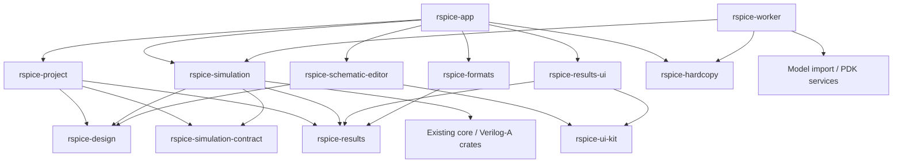

**RSpice application crate architecture review — 2026-09-23**

**Recommendation: rename `rspice-ui` to `rspice-app`, then extract cohesive domain and infrastructure libraries in stages.** The current application has enough independent responsibilities to justify multiple crates. Moving today's directories directly into crates would preserve several dependency cycles and expose far too much mutable state. The valuable change is to establish authoritative owners and narrow interfaces, then have Cargo enforce those boundaries.

The follow-on implementation plan is `crates/rspice-ui/docs/development/app-crate-refactor-plan.md`. It incorporates removal of confirmed-unused legacy code and refines hardcopy into separate contract and rendering packages so persisted design settings do not create a dependency cycle with the renderer.

This review began while the shared checkout was at `adaeb78aafccdd8eabfa25a00cf3d649ae21c344`. Other work advanced it during the review, so the final source measurements and architecture-test results below were rechecked against an isolated `git archive` of **`5d02b0e8b5a1811a46ca7c8f08a8e0113aea8a5e`**. The source tree was clean at the start. This review changed no application implementation, manifest, or package name. The measurements include test code; they are not estimates of production-only code. Numerical correctness, performance, and release readiness were not certified by this review.

**What is actually in the crate**

I counted all `.rs` files below `crates/rspice-ui/src`, read the workspace/package manifests, inspected the existing architecture tests, and followed representative design, persistence, simulation, worker, results, rendering, and platform dependencies. This was a boundary review, not a line-by-line audit of every implementation.

| Source area | Rust files | Physical lines, including tests | Architectural significance |
| --- | ---: | ---: | --- |
| `workbench` | 742 | 621,178 | Shell, document renderers, session state, workflows, lifecycle, hardcopy, adapters |
| `simulation` | 332 | 176,972 | Configuration, preparation, execution, worker protocol, controller, netlisting |
| `state` | 273 | 170,300 | Design/library/project data, results, interaction state, PDK/model services |
| `services` | 85 | 40,625 | Engine adapters, cloud account, DRC, licensing, safety and yield |
| `schematic` | 47 | 32,577 | Editor, symbols, rendering, connectivity helpers |
| `io` | 41 | 31,494 | Project formats, migration, native durability, dialogs, waveform exchange |
| `ui` | 41 | 17,921 | Design system, widgets, plotting |
| `results` | 15 | 17,179 | Visualization/report documents and query contracts |
| `analysis` | 48 | 16,333 | Calculator and derived analysis mathematics |
| Other source areas and crate roots | 54 | 28,119 | Properties, hardcopy contracts, identities, quantities, diagnostics, entrypoints |
| **Total under `src`** | **1,678** | **1,152,698** | |

There are another five integration-test source files totaling 3,641 lines. The directory counts above include the corresponding top-level `area.rs` file. Counting physical lines avoids pretending that inline tests, comments, and conditional code have been classified as production implementation.

`cargo metadata --no-deps --format-version 1` reports 69 workspace packages and **no workspace package depending on `rspice-ui`**. That makes the package rename and removal of application-only exports relatively manageable. The binaries, integration tests, scripts, generated assets, and release packaging still consume its name or paths.

The crate already has useful architectural foundations:

- A private module surface and a documented layering policy in `src/lib.rs`.
- Immutable prepared execution snapshots and one-use dispatch authorization in `simulation/execution`.
- Stable identities, revisions, digests, and transactional design mutations.
- Result documents that separate immutable data from presentation.
- Existing persistence and export seams through `FileWorkflowIo` and `ExportWorkflowIo`.
- Shared native/browser worker transport and substantial parity tests.
- An already extracted `rspice-design-model` with a concrete second consumer, the offline drawing-sheet publisher.

Keep these invariants. Crate extraction should strengthen them.

**The existing architectural guard is currently failing**

I compiled the unchanged `tests/module_layering.rs` directly as a Rust test executable with edition 2024 and `CARGO_MANIFEST_DIR` set to the archived UI package, then ran all its tests. This target uses only `std`, so it can run independently of compiling/linking the million-line application. Result: **6 passed, 5 failed**, matching the earlier working-tree run. This was not a full Cargo build or application test run.

| Check | Result |
| --- | --- |
| Top-level dependency layering | Failed: six recorded edges exceed their ceilings |
| File-size budget | Failed: seven newly oversized files and five listed files above their ceilings |
| Lint-suppression count | Failed: 91 against a ceiling of 54 |
| Module documentation | Failed: 27 files lack the expected module header |
| Public module declaration count | Failed: three against a ceiling of zero |
| Workbench layering, declared layers, whole-app access ceiling, source conventions | Passed |

The dependency failures are particularly relevant:

| Dependency direction | Measured references | Recorded ceiling |
| --- | ---: | ---: |
| `state -> services` | 46 | 9 |
| `state -> simulation` | 19 | 9 |
| `state -> io` | 7 | 5 |
| `services -> simulation` | 32 | 8 |
| `simulation -> workbench` | 44 | 28 |
| `io -> simulation` | 15 | 13 |

These are the existing test's textual `crate::...` counts, including test code, after stripping line comments. They are not compiler-resolved production dependency counts. The public-module failure also counts nested declarations; it does not by itself prove that three modules are externally accessible through the private root modules.

A separate scan found **866 textual `&mut RSpiceApp` occurrences in 161 source files**, including tests; 864 are in workbench. The existing ceiling is 867. This explains why extracting individual workbench folders would require extensive interface work even where the layering check passes.

The historical comments in the layering test and `lib.rs` describe an earlier, smaller tree. In particular, the documented Verilog-A runtime relocation has already happened: `simulation/veriloga.rs` now owns `PreparedVerilogARuntime`. Use current imports, not old remediation comments, to plan the remaining work.

**Recommended ownership and crate boundaries**

The following is a destination architecture, not a proposal to create every crate in one change. Each new library needs a concrete consumer, a bounded responsibility, and independently useful tests. Existing engine, matrix, Verilog-A, cloud, trust, publication, and automation crates remain in place.

| Package | Responsibility and source to extract | Boundary rule |
| --- | --- | --- |
| `rspice-app` | Rename the application. Retain eframe entrypoints, composition, workbench chrome/routing, cross-feature coordination, dialogs, session recovery integration, and platform adapter wiring. | Nothing below it depends on it. It remains an application, not the public API for every subsystem. |
| `rspice-app-types` | Shared application identities, revisions, source identity, and portable quantity policy from `product`, `source_revision`, and the pure parts of `quantity`. | Small value vocabulary only. No project aggregate, engine, GUI, filesystem, or service registry. Preserve existing canonical types through re-exports where appropriate. |
| `rspice-design` | Schematic and symbol documents, Library/Cell/View ownership, hierarchy, configuration binding, connectivity, design transactions, reference changes, source registry, and reusable design checks. Primarily selected `state` modules and pure schematic/DRC code. | Own design meaning and validated edits. No dialogs, active viewer, simulation controller, cloud transport, or file picker. |
| `rspice-simulation-contract` | Authored plan/configuration types, validated request vocabulary, progress/error messages, and worker envelopes. Extract these from `simulation/plan`, `config`, data currently named `dialog`, and durable portions of `workbench/app_state/sim_setup`. | No executor, thread spawning, eframe, native JIT, or workbench state. Depend only on stable value/result contracts as needed. |
| `rspice-simulation` | Netlist preparation, sealed source compilation, execution permits, run scheduling/cancellation, analysis adapters, checkpoints, safety/yield execution, engine bridges, and worker execution. | Consume immutable design/model inputs and explicit requests. Publish typed events/results. Never mutate `AppState` or select a viewer. |
| `rspice-results` | Immutable datasets, result provenance/history, visualization/report documents, exact queries, calculator/FFT/eye/statistical computation, and durable result presentation. Draw from `results`, `analysis`, selected `state/simulation`, and `state/result_presentation`. | Own result meaning and exact numerical data. No simulation controller, workbench, widgets, or application state. Keep rendering caches and platform codecs outside. |
| `rspice-project` | Project aggregate/snapshot, project format migration and validation, accepted baseline, dirty/save transaction semantics, and document registry. Draw from `io/project_*` and the headless part of project lifecycle. | Compose design, plan, and result contracts. No dependency on the execution implementation or UI. Persistence happens through an explicit storage boundary. |
| `rspice-formats` | Engineering data import/export codecs: waveform formats, CSV/TSV, Arrow/Parquet, spreadsheet, HDF5, NumPy, MATLAB, VCD, etc. Move codec bodies from `io`, table code, and `workbench/menu_bar/waveform_export`. | Consume typed data and streams/bytes; return typed data/artifacts. No chooser dialogs, active-tab lookup, or notifications. Project schemas stay with `rspice-project`. |
| `rspice-ui-kit` | Tokens, theme, fonts/icons, common widgets, generic code/table controls, and egui plot painting. Mostly today's `ui`. | May depend on egui and narrow value types. Must not depend on project, simulation, design services, or `rspice-app`. |
| `rspice-worker` | A separate browser worker package, replacing the second binary's dependency on the entire application library. | Depends on execution/import/rendering libraries and transport glue; no eframe, egui, wgpu, or workbench dependency. |

Three further presentation/service extractions are appropriate once the interfaces below are established:

| Package | What makes the boundary useful |
| --- | --- |
| `rspice-schematic-editor` | Egui canvas, tools, symbol editing, local editor session, hit testing and interaction. Depends on `rspice-design` and `rspice-ui-kit`; emits typed edits/navigation requests. It does not own the project lifecycle. |
| `rspice-results-ui` | Result-document views, Visualization Studio, report authoring, viewer state, cursors and interaction. Depends on `rspice-results` and `rspice-ui-kit`; it receives datasets explicitly. This removes a large coherent feature from workbench. |
| `rspice-hardcopy` | Framework-independent scene/pagination/rendering and hardcopy worker operations, with immutable source snapshots. Start from `hardcopy` and `workbench/hardcopy_adapters`. Source adapters must be separated from access to live workbench state and printer APIs. |

Model/PDK operations also deserve a named boundary. Establish a `model_library` module/service with catalog ownership, retained source closure, signed PDK validation, and model import operations; promote it to **`rspice-model-library`** as the worker import paths are extracted. This is a concrete shared consumer, not a speculative reuse argument. Its portable contracts/validation must be separable from compiler execution, installation storage, and cloud transport. Depending on the resulting graph, that may warrant a small contract subpackage; do not put an entire compiler behind a nominally lightweight catalog crate.

Do not expand `rspice-design-model` into the whole project/application model. Its current narrow dependency closure is deliberate: the offline publisher uses its drawing-sheet and signing contracts. `rspice-design` should depend on that existing library. `ContentDigest` already has one owner there; continue re-exporting it rather than creating a competing digest type.

**Dependency direction**

Arrows below mean “depends on.” This diagram shows the principal boundaries; shared value types and existing engine support crates are omitted to keep it readable.

`rspice-project` is the upper aggregate: it can contain design documents, simulation plans, and retained results. Neither the design model nor results should depend on that aggregate. The simulation runtime consumes the relevant frozen inputs; it does not require the entire project or UI session. This prevents a `project <-> simulation` cycle.

Keep simulation-result conversion explicit. `rspice-core::execution::AnalysisResultDocument` is already the engine result authority used by other frontends. An application result library must not create another numerical truth or reimplement analysis algorithms that already belong to the engine. Application documents add dataset identity, provenance, retained presentation, and postprocessing; adapters preserve the engine payload. Where low-level engine value/metadata types prevent a lightweight result contract, move the minimum shared definitions downward or retain a deliberate core dependency during migration. Do not duplicate schemas merely to make a dependency graph look cleaner.

**The interface work that must precede extraction**

1. **Separate durable documents from editor sessions.** `state/schematic/state.rs:303` combines components/wires with selection, active tool, pan/zoom, drawing gestures, caches, and undo state. Many transient fields are already `serde(skip)`, so this is a type-ownership problem rather than evidence that all those fields are persisted. Split document content, transaction/history state, and per-view interaction state. A reusable editor can then accept a document view and a local session without owning the application.

2. **Move authored simulation plans out of workbench.** `io/project_execution.rs:26` imports `workbench::app_state::SimSetupState`, and its persisted `ProjectExecutionContext` contains that type. `simulation/plan/config.rs` imports workbench setup types too. Move the persisted plan, authored expressions, stable analysis identities, and validation to the contract layer. Dialog visibility, selected row, and uncommitted edit buffers remain presentation concerns. Preserve user-authored expressions and current migration behavior; do not silently replace them with rounded or pre-evaluated numbers.

3. **Separate execution from UI reaction.** `simulation/controller.rs:54` imports `AppState`, `ActiveViewer`, and viewer-cache provenance; its next import reaches a workbench export interface. `controller/transient_post.rs` manages derived viewer state, and `execution/snapshot.rs` has an `apply` method taking `AppState`. Keep the parts that update tabs, console displays, and caches in app/presentation coordinators. The executor should accept prepared requests and emit events carrying project/run/revision identity. Preserve existing generation checks, cancellation identity, single-use permits, and stale-completion rejection.

4. **Untangle results from execution services.** `state/simulation` imports safety/yield types and Monte Carlo runtime checkpoint definitions; `state/simulation/ac_bode.rs:372` calls a sampler owned by `ui::plot`. Result evidence and durable checkpoint contracts belong below execution, with computation and conversion on the appropriate side. Move exact sampling/math below plotting so measurement does not depend on the renderer. Rendering decimation remains a cache, never the source for calculations or exports.

5. **Move small misplaced helpers to their real owners.** The calculator parser currently calls `simulation::controller::spice_value::parse_spice_value_checked`. This is lexical parsing, not controller behavior. Place the shared parsing primitive below both consumers while keeping interactive quantity parsing, SPICE dialect rules, and layout database units distinct. Source-content digest helpers used by simulation should likewise live below the code editor.

6. **Separate storage/transport from domain decisions.** `state/pdk_config/persistence.rs` reaches `io/durable_file`; Model Hub state includes storage/cloud implementations; quantity locale lookup calls Windows/JavaScript APIs. Move those adapters outward. Keep ports small and owned by the subsystem consuming them. Start with native/browser adapter modules in the app or service package; a universal `rspice-platform` crate is unnecessary until those boundaries have an independent consumer.

7. **Separate hardcopy inputs from live-state resolution.** The hardcopy renderer already defines a semantic scene and claims platform independence, but imports source-adapter types, schematic symbols, and design state. Move plain scene/source snapshot definitions below both renderer and app adapters; keep platform printing separate. The worker should receive a bounded, revision-authenticated snapshot, not reconstruct an application to print.

A suitable editor boundary is conceptually `show(document_view, editor_session, capabilities) -> edit_requests`; the design owner validates and commits requests against an expected revision. A suitable execution boundary is `prepare(frozen_inputs) -> prepared_run`, then `submit(prepared_run) -> run_handle`, followed by identity-bound progress/completion events. These are interface sketches, not prescriptions to add a generic framework or serialize every local call.

Do not replace `&mut RSpiceApp` with an equally powerful `&mut AppContext` or a universal service locator. Pass the actual state/services needed. Keep hot simulation loops and frame rendering on direct typed calls, borrowed views, and shared immutable sample buffers; do not introduce whole-project clones or per-sample message traffic merely to cross a crate boundary.

**Desktop, browser, and tablet implications**

The current worker binary calls into `rspice_ui` for simulation, Verilog-A compilation, hardcopy, model import, and PDK import (`worker_main.rs:180` onward; implementations are re-exported from `lib.rs`). Consequently, extracting simulation alone cannot produce the intended GUI-free worker. Either complete these service extractions before switching the worker package, or retain the current worker until they are ready. Do not ship parallel implementations of the same operation.

The current application manifest depends on GUI, solver/compiler, data codecs, printing, cloud, and filesystem stacks. Separate packages let a worker, codec test, or domain test select a smaller dependency closure. They do **not** prove a smaller shipping Wasm image: current entrypoint reachability and LTO already remove unreachable code, and runtime imports can keep code reachable. Measure native rebuild time, browser UI/worker sizes, startup, memory, and runtime after representative extractions.

Prefer target-specific dependencies and explicit executable packages for platform ownership. Cargo features are additive and dependencies can unify their enabled features, so “UI” and “worker” features alone are a weak substitute for a structural package boundary. Keep separate build invocations for the shipping browser UI and worker and inspect each resolved graph. See the [Cargo feature reference](https://doc.rust-lang.org/cargo/reference/features.html#feature-unification).

One shared application/presentation layer should support desktop and browser layouts, touch, pen, keyboard, and accessibility. Input modality and capability policy belong in presentation and platform adapters; they should not fork the design or simulation model. “Tablet” still needs an explicit deployment decision: browser/PWA delivery and native iPadOS/Android hosts have different host integration and qualification requirements. This review does not establish current native mobile support or browser compatibility. The present browser entrypoint explicitly requires WebGPU; moving crates does not change that requirement.

Existing boundaries should stay distinct: `rspice-wasm` is an engine-facing JavaScript API, `rspice-engine-adapter` serves a cloud execution protocol, and `rspice-viewer` is a published-page viewer. None is a drop-in replacement for the application worker or interactive results editor. Reuse underlying contracts/implementation where semantics match, without merging their public protocols.

**Migration sequence**

| Stage | Work | Acceptance condition |
| --- | --- | --- |
| 0 | Record a reproducible baseline and repair current architecture violations/guard failures. Review test-only edges separately from shipped dependencies. | Guards pass for substantive reasons. No blanket ceiling increase or dependency exception to conceal growth. |
| 1 | Rename package/path/library to `rspice-app` in a separate mechanical change. | Native and browser entrypoints, CI, scripts, fixtures, docs, and packaging use the intended names. Runtime storage keys, wire schemas, and JS ABI do not accidentally change. |
| 2 | Extract the small shared vocabulary and `rspice-ui-kit`; establish result and simulation-contract modules inside the existing package before moving them. | Minimal APIs, one owner per value type, no upward imports. Existing tests follow the owning code. |
| 3 | Extract results and declarative simulation contracts; then design/model contracts. Resolve the known cycles and relocate integration tests that span owners. | These libraries build/test without eframe/wgpu and without linking the app; result math does not require its renderer. |
| 4 | Extract `rspice-project` and `rspice-formats`; move source resolution and model/PDK import service boundaries. | Project loading/saving and format conversion work through headless APIs. Golden files, migrations, digests, and transactional storage semantics remain compatible. |
| 5 | Extract simulation execution and hardcopy services, then switch to `rspice-worker`. | Worker dependency graph contains no GUI stack; all current worker operations remain covered; native/browser parity and cancellation tests pass. |
| 6 | Extract schematic and results presentation libraries after they stop reaching into whole-app state. | Editors/viewers can run in focused egui harnesses using explicit inputs and typed actions. Workbench remains the composition owner. |

The package name, binary name, JavaScript export names, application data paths, and file schemas are separate compatibility decisions. The package should become `rspice-app`; retaining an existing binary/JS name temporarily is possible and may simplify rollout. If the binary is also renamed, update release installers, wasm-bindgen output names, worker URLs, browser manifests, cache identities, and CI atomically. Do not global-search-and-replace serialized identifiers or signed content.

During extraction, move build generation with its owner: the results catalog generated from `contracts/result-data-contract.json` belongs with the results contract; icons belong with the app; worker build/protocol identity must remain synchronized across both images. Audit `include_str!`, `include_bytes!`, fixture roots, `OUT_DIR`, and `CARGO_MANIFEST_DIR` assumptions.

The current native project publication code has expected-content compare/exchange, writer leases, and recovery semantics. The existing `rspice-output` crate provides valuable atomic artifact primitives, but that does not make it a drop-in replacement for `io/durable_file`. Consolidate only the operations whose contracts actually match, and retain conflict/recovery behavior explicitly.

**Verification that makes the split worthwhile**

- Enforce allowed package dependencies through `cargo metadata`, including target-specific dependency closure. Keep module-level rules inside the remaining large crates. Do not rely solely on searching `crate::` text, which misses relative imports and aliases.
- Preserve the field-to-engine projection tests, preparation/dispatch parity, stale-run rejection, worker transport tests, generated-model feature coverage, and source/digest identity checks. Put cross-crate scenarios in an app/integration harness; do not introduce upward dev-dependencies merely to keep tests in their old files.
- Verify project save/load/migration/recovery, selected-document Save versus Save all, undo/redo, hierarchy edits, netlist determinism, retained results, and signed package bytes. Moving Rust modules should not itself require a file-format migration.
- Preserve f64/complex128 authoritative samples and existing mixed-signal event semantics. Native and browser transfer must retain its typed-buffer behavior; display caches must remain disposable. Use bitwise comparison for behavior-preserving serialization/identity cases and the existing numerical tolerances for engine/platform comparisons.
- Measure representative incremental edits in the UI kit, a viewer, and simulation implementation; measure test-link time and shipped artifact sizes. Crates are a compilation boundary, not a guaranteed speedup. A heavily shared contract change can still rebuild most of the application.
- Run the existing platform and real browser interaction checks after integrations. Include narrow/touch layouts and accessibility at presentation boundaries. Headless tests cannot establish interaction quality.

Keep library internals private and expose validated operations rather than public bags of fields. All of these packages can remain private workspace implementation crates (`publish = false`) and evolve together; there is no need to promise a third-party SDK or independently version each subsystem now.

**What I would avoid**

Do not create one crate per analysis type, dialog, dock, or platform. Do not extract a giant `rspice-state`, `rspice-common`, or `rspice-services` crate carrying the same mixed ownership under a different name. Do not recreate the former `common <-> workbench` split recorded in the layering test: the underlying shared mutation was the problem. Avoid a plugin framework, microservices, or a universal event bus as part of this work.

The strongest initial return is a trustworthy headless design/result/plan/project boundary and a worker that does not depend on the application shell. The UI feature crates become valuable once they consume those boundaries. Commercial quality depends on the preserved contracts and measured behavior; crate count is only the mechanism used to protect them.
