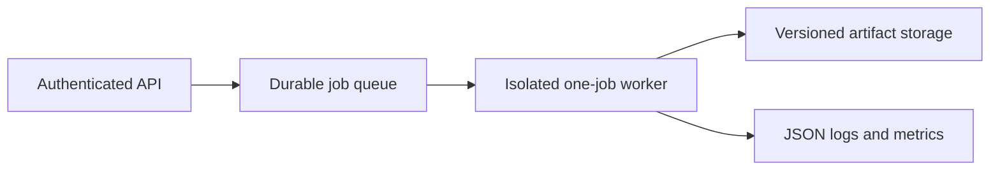

# RSpice backend production runbook

This runbook defines the production contract for the native `rspice` backend.
It applies to batch, API-backed, and multi-tenant deployments. The checked
[`config/production.toml`](../../config/production.toml) is a conservative
starting profile for a four-vCPU worker; it is not a substitute for workload
capacity testing.

## Service boundary

`rspice` is a one-shot simulator process and library, not an HTTP service. It
does not provide authentication, authorization, TLS termination, tenant
storage, queueing, billing, or network policy. A production service must put
those responsibilities in a controller around the native process.



Run one unprivileged `rspice` process per job. Reusing an OS process across
tenants is not a supported isolation boundary. The engine is stateless between
processes; shared caches are performance aids and may be discarded.

## Required worker isolation

For untrusted or cross-tenant inputs, every job must have all of the following:

- A fresh container, sandbox, VM, or equivalent OS-enforced process boundary.
- A non-root identity with no privilege escalation and no host namespaces.
- No outbound network and no inbound listener.
- No secrets in files, environment variables, command arguments, or inherited
  handles visible to the worker.
- A read-only job input tree and read-only, versioned model bundle.
- A dedicated writable scratch/output directory that no other job can access.
- CPU, memory, process, open-file, output-size, and hard wall-clock quotas.
- An allowlisted environment. In particular, remove ambient `RSPICE_*`
  variables unless the controller intentionally records and applies them.

Netlists can reference include, library, PWL/data, and Verilog-A files. The OS
sandbox is therefore the authoritative filesystem boundary. Mount only the
job input and approved model roots. Do not expose `compile-va` as a public API,
and allow external `.VERILOGA`/`.VA` model compilation only in a trusted-model
lane. The public simulation lane should accept reviewed, versioned model
bundles rather than arbitrary compiler inputs.

## Worker startup and probes

Install an attested release archive as described in
[`native-release.md`](native-release.md). Record `rspice --version`; it includes
the version, target, profile, and exact source commit.

Run liveness before admitting work:

```bash
rspice --config production.toml health --mode liveness --json
```

Run readiness after mounts, quotas, and configuration are in place:

```bash
rspice --config production.toml health --json
```

Liveness validates startup and effective engine configuration. Readiness also
executes a deterministic bounded circuit through parsing, construction, matrix
assembly, and solve. Both are process probes, not HTTP endpoints; a service
controller may translate their exit code and versioned JSON document into its
platform's probe protocol. Never route jobs to a worker image whose readiness
probe is nonzero or whose reported commit differs from the intended release.

## Admission and job lifecycle

1. Assign an immutable job ID and create a fresh job directory.
2. Materialize the root deck, every include/model/data dependency, the explicit
   config, and the requested command as immutable inputs. Record SHA-256
   digests and model-bundle version.
3. Reject disallowed commands and model directives at the API policy layer.
4. Optionally run `rspice check deck.sp --connectivity --strict` under the same
   config and sandbox. A successful check is not a simulation result.
5. Start the run with JSON diagnostics, JSON logs, a cooperative timeout, an
   explicit summary, and output paths inside the job directory.
6. Enforce a controller hard deadline slightly beyond `--timeout`. Send the
   platform's normal interrupt first; force termination only after a bounded
   grace period.
7. Capture the exit code, stdout/stderr, resource usage, and every artifact.
8. Promote outputs only when the process exits `0` and the summary has
   `schema_version = 1`, `passed = true`, and `status = "passed"`.
9. Quarantine or delete outputs from nonzero, interrupted, force-killed, or
   summary-incomplete runs. Individual output files are not commit markers.

Example worker command:

```bash
rspice --config production.toml \
  --log-format json --error-format json --log-level info \
  run input/deck.sp --timeout 600 --summary output/summary.json \
  --report-format junit --report-file output/results.xml \
  --output results.raw
```

Do not use `--allow-failed-meas` or `--allow-nonfinite` in a production
verification lane. Stable exit codes distinguish simulation errors,
verification failures, input/configuration failures, I/O failures, timeouts,
and interrupts; the CLI README is the canonical table.

## Resource and concurrency policy

RSpice validates explicit ceilings for root and expanded source, dependency and
external data, include/hierarchy depth, flattened elements, nodes and matrix
unknowns, analysis/result points, cache bytes, batch amplification, and worker
fan-out. The effective values are emitted in each run summary.

These limits supplement rather than replace OS quotas. Sparse matrix fill,
third-party libraries, allocator overhead, JIT code, file output, and future
features cannot all be represented by one in-process counter. Keep the
controller's hard limits authoritative.

Use `max_parallel_workers` as both the per-job engine ceiling and the basis for
capacity planning. Nested engine work is bounded by that ceiling. A practical
starting point is:

```text
worker_processes <= min(
  floor(available_vCPU / workers_per_job),
  floor(available_memory / measured_peak_memory_per_job)
)
```

Measure peak resident memory, CPU seconds, output bytes, and p95 duration for
representative small, median, and worst-admitted decks. Leave headroom for the
controller and filesystem cache. Do not oversubscribe jobs merely because a
typical deck is single-threaded; AC, Monte Carlo, corner, and future batch
analyses can consume the configured worker ceiling.

Changes to solver tolerances or convergence mode alter numerical behavior and
checkpoint identity. Treat them as versioned product configuration, not an
on-call performance knob.

## Observability and alerting

Ingest newline-delimited JSON logs and keep the process `run_id` as the join key
for logs, structured fatal diagnostics, summaries, queue records, and artifacts.
Preserve the exact source commit reported by the binary rather than relying on
an image tag alone.

The controller should export at least:

- Queue age, admitted/running/completed job counts, and end-to-end latency.
- Run duration, CPU time, peak resident memory, output bytes, and worker count.
- Counts by exit code, stable error code/category, analysis, and retry policy.
- Timeout, interrupt, force-kill, resource-limit, non-finite, convergence, and
  readiness-failure counts.
- Checkpoint save/resume success and refusal counts.
- Deployed version/commit and model-bundle version.

Page immediately on readiness failure, repeated internal-error exit `70`,
artifact checksum/provenance failure, or evidence of cross-tenant access.
Alert on sustained queue-age SLO breach, timeout or force-kill rate above the
service baseline, memory pressure, disk exhaustion, and latency regression.
Tune numeric thresholds from load tests; do not hide a regression by widening
simulator limits globally.

Netlists, model parameters, paths, and waveforms may be confidential. Apply the
same access controls, retention, regional placement, and redaction policy to
logs and diagnostics as to job artifacts.

## Durable artifacts and recovery

RSpice itself owns no database. The controller's artifact store is the system
of record. Persist this set for every accepted result:

- Root deck and all resolved include, library, PWL/data, and model inputs.
- SHA-256 digest and version of each input and approved model bundle.
- Exact command, sanitized environment overrides, and effective config.
- Release version, commit, target, checksum, attestation evidence, manifest,
  SBOM, and container/worker image identity.
- Run summary, JSON logs, structured fatal diagnostic, reports, measurements,
  result files, and resource-usage record.
- Any checkpoint selected for later continuation.

Use versioned or content-addressed object keys and storage-side encryption,
retention, and immutability appropriate to the workload. Caches, extracted
release directories, and worker scratch space are disposable and need no
backup.

Checkpoint files are validated before I/O, flushed, and atomically replace the
destination in the same directory. Resume additionally verifies a
collision-resistant netlist identity and the resolved state-affecting
simulation configuration; incompatible or legacy state fails closed. Even so:

- Write checkpoints on a local durable filesystem, then checksum and upload
  them only after the process has completed successfully.
- Store checkpoints under immutable generation keys. Keep at least the current
  and previous successful generation until the job is complete.
- Archive the exact binary/config/input set with the checkpoint. Treat
  checkpoints as release-coupled; do not assume downgrade compatibility.
- Never edit a deck, included data, model bundle, solver setting, or transient
  method between checkpoint and resume.
- Run a quarterly restore drill: verify release provenance, restore inputs and
  a checkpoint into an isolated worker, resume, and compare against an
  uninterrupted golden run.

## Upgrade and rollback

Before an upgrade:

1. Verify the release checksum, attestation, manifest, SBOM, and source commit.
2. Confirm CI, security, conformance, and same-host macro performance gates.
3. Run the production readiness probe and the deployment's golden deck set.
4. Test checkpoint resume for any job class allowed to span deployments.
5. Canary the new binary/config/model tuple on a small share of new jobs while
   old workers remain available.

Compare success rate, stable error categories, duration, memory, and waveform
goldens. Then increase traffic in stages and drain old workers; never replace a
binary beneath a running job.

Rollback is a routing change to the previously verified binary, config, and
model-bundle tuple. Stop admitting new jobs to the suspect version, allow safe
in-flight work to finish or cancel it through the normal path, and quarantine
its unpromoted outputs. Resume a checkpoint on the version that created it
unless cross-version compatibility was explicitly tested. There is no RSpice
database migration to reverse.

## Incident checklist

1. Stop rollout and record the first affected time, run IDs, release commit,
   config digest, model-bundle version, worker image, and affected tenants.
2. Preserve input/output/checkpoint hashes, JSON diagnostics, logs, exit codes,
   and OS resource telemetry. Do not rerun confidential input outside its
   original access boundary.
3. Classify the failure: bad input/verification, convergence, resource limit,
   timeout, I/O, internal error, infrastructure, or security isolation.
4. Reproduce with the exact immutable artifact tuple in an isolated worker.
5. Roll back new admissions when the release/config/model tuple is implicated.
6. For integrity or security events, preserve evidence, rotate exposed secrets
   in the surrounding service, and follow [`SECURITY.md`](../../SECURITY.md).
7. Publish a corrected patch release; never move a release tag or replace a
   published asset.
8. Add a regression deck/test, update capacity or runbook controls, and record
   the restore/rollback result before closing the incident.
